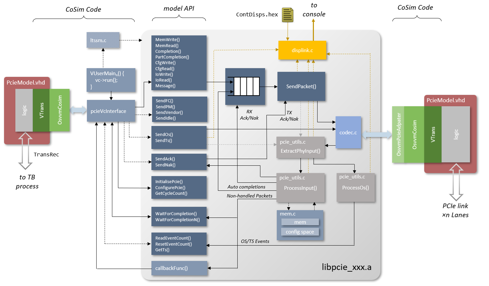
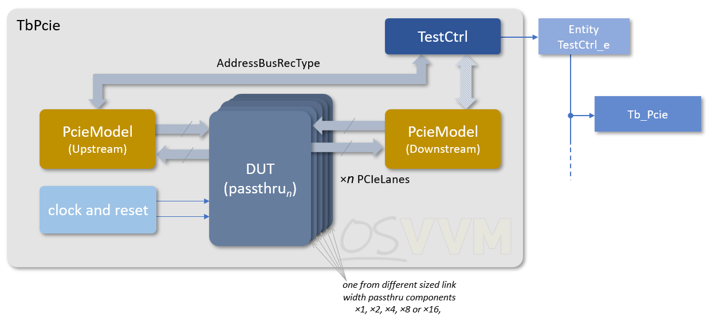

# PCIe Virtual Component



## VC Features

PCIe GEN1/GEN2 verification component (VC) for OSVVM. The model has the following features:

* Is a co-simulated VC, with a PCIe C model
* Supports link widths &times;1, &times;2, &times;4, &times;8 and &times;16
* Internal memory space model accessed with incoming memory write/read requests
    * Can be disabled so transations passed to user test code
* Internal configuration space model accessed with incoming configuration space write/read requests
    * Can be disabled so transations passed to user test code
* Auto-generation of read completions (can be disabled)
* Auto-generation of 'unsupported' completions (can be disabled)
* Auto-generation of Acks/Naks (can be disabled)
* Auto-generation of Flow control (can be disabled)
* Auto-generation of Skip OS (can be disabled)
* User generation of all TLP types
    * Memory Reads/Writes
    * Config Reads/Writes
    * IO Reads/Writes
    * Messages
    * Completions
* External generation of training sequences
    * Via supplied demonstation LTSSM C code as partial implementation
* 8b10b encoding and decoding (can be disabled)
* Scrambling and Descrambling (can be disabled)
* PIPE data interface supported
    * By connecting lane ports to 9 bit wide signal vectors, which disables scrambling and 8b10b
* Proper throttling on received flow control
* Lane reversal
* Lane Inversion
* Serial input/output support via VHDL wrapper
* Programmable FC delay (via configuratoin of Rx packet consumption rates)
* Programmable Ack/Nak delay
* Integrated formatted link transaction display output
    * Configurable from a file
    * Three main levels of detail, individually enabled or disabled
    * Can active or dactivate output at specified cycles
    * Can activate or deactivate colour formatted output

## The Test Benches

There are three test benches for the PCIe VC that demonstrate the VC main configurations. The first, `TbPcie`, uses the VC in a "classic " manner with an "upstream" requester" and "downstream" responder driven by VHDL test programs. The second, `TbPcieAutoeEp` uses the VC with the downstream VC as and endpoint configured for auto-completion and internal memory models. The last, `TbPcieSerial` is similar to the auto-completion test bench, but uses the serialisation wrapper VHDL for single bit lanes. The diagram below shows the "classic" testbench structure, but all have a similar architecture. Certain configurations can be controlled from constant definitions at the top of the test bench files (e.g. `TbPcie.vhd`), such as link width PIPE or 8b10b encoded data, and others.

<p align=center>

</p>

### Running the Tests

To build the VC model and run the tests from a clean simulation directory the following commands can be used (e.g. for Riviera-PRO&mdash; adjust for particular simulator as per the documentation).

```
source <path to OsvvmLibraries>/Scripts/StartUp.tcl
source <path to OsvvmLibraries>/OsvvmLibraries.pro
build  <path to OsvvmLibraries>/PCIe/testbench
build  <path to OsvvmLibraries>/PCIe/testbench/tests.pro
```
