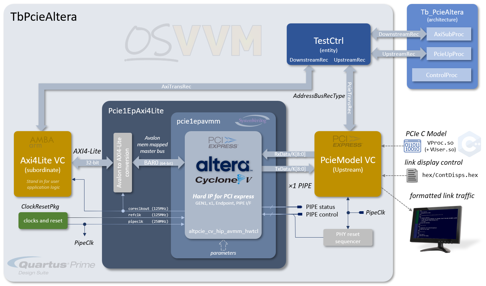

# VHDL Test Environment for Altera Cyclone V Hard IP for PCI Express

This directory contains an example VHDL test bench for driving the simulation model of the _Altera Cyclone V Hard IP for PCI Express_ using the CoSimPCIe VC. The test bench has been constructed for use with the _Quartus Prime SC Lite Edition version 25.1std_, including the _Questa Altera Starter FPGA Edition-64 2025.2_ simulator. Pre-compiled libraries for the PCIe IP are provided for these editions. For different editions, the pre-compiled libraries may not function and a QSYS file is provided to generate the simulation source files and build the libraries from scratch. .

<span style="color:red">**THIS TESTBENCH IS FOR QUESTA SIMULATOR ONLY.**</span>

# Test Bench Structure

The diagram below shows the structure of the test bench.



The top level `TbPcieAltera` module instantiates the Altera PCIe component, wrapped in a SysteVerilog module (`pcie1epavmm`) to abstract away the setting of the configuration parameters and only expose the ports that are required. Within this wrapper, the Altera PCIe IP is configured in the following way:

* GEN 1
* An Endpoint
  * Completer only
* Single Lane PCIe link
* PIPE interface (only for simulation&mdash;not supported for synthesis)
* Single configured 32-bit, non-prefetchable BAR, resulting in a single Avalon memory mapped master interface
    * 32-bit address
    * 64-bit data

The `pcie1epavmm` module also contains logic to convert the 64-bit data bus to 32-bits AXI4-Lite transactions, so it can connect to an AXI4Lite VC.

A  CoSimPCIe VC component is instantiated, configured as a single lane PCIe interface and wired for PIPE operations. The single lane PIPE TX and RX ports are connected to the `pcie1epavmm` PIPE data ports. It is driven from and instantiated `TestCtrl` via an `AddressBusRecType` signal, `PcieTranRec`, driven from a `PcieUpProc` process in `Tb_PcieAltera.vhd`

The AXI4-Lite memory mapped interface is connected to an Axi4-Lite VC with an equivalent slave interface. This acts as a target for memory reads and writes, in place of what would be the user application logic as either a single unit block, a sub-system of even the whole design logic. It  is also connected to `TestCtrl` via an `AddressBusRecType` signal, `AxiTransRec`, to be driven, as a subordinate, from an `AxiSubProc` process in `Tb_PcieAltera.vhd`.


The `TcPcieAltera` test bench has a process to generate the PHY receiver reset sequence for the appropriate PIPE control signals in order to bring the receiver out of reset. Finally, the top level `test` generates two clocks and a power-on reset signal. The Altera PCIe IP requires a `pipeclock` at the appropriate frequency for the interface. As this is for GEN1, and the PIPE interface is configured to be 8-bits, then this is generated at 250MHz. A reference clock (`refclk`) is also required. The Altera IP allows for either a 100MHz clock or a 125MHz clock and, for this test bench, the IP is configured for 125MHz. The Altera IP generates a `coreclkout` signal, at 125MHz (regardless of the `refclk` frequency) which is the clock that the AXI interface uses, and so the Axi4Lite VC clock is connected to this. The CoSimPCIe VC component is connected to the `pipeclk` signal.

At run time, the simulator will load the compiled `VProc.so` library containing the PCIe C model, which will load the binding user program in `VUser.so` at run-time. The PCIe model will then load the _DispLink_ text control file from `hex/ContDisps.hex` to determine the decoded link display information sent to the console.

# The Test Program

## Building and Running the Test

Before running the test, it is assumed that the OSVVM library has been compiled, which includes compiling the PCIe VC VHDL files, and that the PCIe test benches have been compiled. The steps can be achived with the following commands from a Questa TCL prompt:

```
  source <path to OsvvmLibraries>/Scripts/StartUp.tcl>
  build <path to OsvvmLibraries>/OsvvmLibraries.pro
  build <path to OsvvmLibraries>/CoSimPCIe/testbench
```

To run the test, a script like the following can be used:

```
  library    osvvm_TbPcie

  ChangeWorkingDirectory <path to OsvvmLibraries>/CoSimPCIe/tests
  MkVproc    vc

  SetLogSignals true

  SetExtendedSimulateOptions +nowarnPCDPC
  SetExtendedOptimizeOptions [AlteraLibArgs]

  TestName CoSim_PcieAltera
  simulate Tb_PCIeAltera [CoSim]
```

With the above script in a file, `test.pro`, say, in the local directory, the test is run with:

```
  build test.pro
```

## The Test Functionality

For this test, the user test code in the `PcieUpProc` process, in the file `CoSimPCIe/testbench/TbPcieAltera/Tb_PcieAltera.vhd`, does the following steps, in order.

* Waits for POR to be deasserted
* Initiates the link training sequence from electrically idle to the L0 "Link Up" state (`L0`)
* Initiates DLL VC0 flow control initialisation
* Enumerates the Configuration space
  * Does a configuration space write of all 1's to BAR0
  * Does a configuration space read back of BAR0 and verifies a 4K non-prefetchable 32-bit space
  * Does a configuration space write the control register to enable memory accesses
* Does configurations space reads, and prints out contents, from 
  * PCI space Vendor ID and Device ID
  * PCI space Command and Status registers
  * PCI space Revision ID and Class Code
  * PCI space BIST field, Header Type, latency timer and cache line size
  * PCI space BARs 0 to 5
  * PCI space Cardbus CIS pointer
  * PCI space Subsystem ID and Subsystem Vendor ID
  * PCI space Expansion ROM base address
  * PCI space Capabilities pointer
  * PCI space reserved REG 14
  * PCI space Max latency, min grant, interrupt ping, interrupt line
* Writes a 32-bit word to memory with a memory write command
* Writes a 16-bit word to memory with a memory write command
* Reads back first word with a memory read command and verifies
* Reads back second half-word with a memory read command and verifies
* Waits for some cycles
* Finishes the simulation

# The Model and Test Output

When the test is run, a configured `hex/ContDisps.hex` can display decoded link traffi, mixed in with the test output. When run with `hex/ContDisps.hex` configured for no DispLink output, the model and test program outputs the following (minus some PLL output from the Altera IP):

```
VInit(62)
InitialisePcie() called from node 62
InitialisePcie: Info --- valid linkwidth (1) at node 62
  pcieVHost version 1.9.0

---> Detect Quiet (node 62)
---> Detect Active (node 62)
---> rcvr_idle_status = 0 (node 62)
---> Polling Active (node 62)
---> Polling Config (node 62)
---> Active lanes = 0x0001 (node 62)
---> Configuration Start (node 62)
---> Configuration Linkwidth Accept (node 62)
---> Configuration Lanenum Wait (node 62)
---> Configuration Lanenum Accept (node 62)
---> Configuration Complete (node 62)
---> Configuration Idle (node 62)
---> Configuration exit to L0 (node 62)
# %%  91124 ns    Log    PASSED    in Default,                      Config Space Write Error Status #1:  Received : 0
# %%  91124 ns    Log    PASSED    in Default,                      Config Space Write Completion Status #1:  Received : 0
# %%  92100 ns    Log    PASSED    in Default,                      Config Space Read Error Status #2:  Received : 0
# %%  92100 ns    Log    PASSED    in Default,                      Config Space Read Completion Status #2:  Received : 0
# %%  92100 ns    Log    PASSED    in Default,                      Config Space Read Completion #2:  Received : FFFFF000
# %%  93044 ns    Log    PASSED    in Default,                      Config Space Read Error Status #3:  Received : 0
# %%  93044 ns    Log    PASSED    in Default,                      Config Space Write Completion Status #3:  Received : 0
# %%  94004 ns    Log    PASSED    in Default,                      Config Space Write Error Status #4:  Received : 0
# %%  94004 ns    Log    PASSED    in Default,                      Config Space Write Completion Status #4:  Received : 0
# %%  94980 ns    Log    PASSED    in Default,                      Config Space Read Error Status #5:  Received : 0
# %%  94980 ns    Log    PASSED    in Default,                      Config Space Read Completion Status #5:  Received : 0
# %%  94980 ns    Log    INFO      in Default,                          PCI REG0  : Device ID               0001
# %%  94980 ns    Log    INFO      in Default,                                    : Vendor ID               14FC
# %%  95924 ns    Log    PASSED    in Default,                      Config Space Read Error Status #6:  Received : 0
# %%  95924 ns    Log    PASSED    in Default,                      Config Space Read Completion Status #6:  Received : 0
# %%  95924 ns    Log    INFO      in Default,                          PCI REG1  : Status                  0010
# %%  95924 ns    Log    INFO      in Default,                                    : Command                 0002
# %%  96884 ns    Log    PASSED    in Default,                      Config Space Read Error Status #7:  Received : 0
# %%  96884 ns    Log    PASSED    in Default,                      Config Space Read Completion Status #7:  Received : 0
# %%  96884 ns    Log    INFO      in Default,                          PCI REG2  : Class Code              02
# %%  96884 ns    Log    INFO      in Default,                                    : Subclass                80
# %%  96884 ns    Log    INFO      in Default,                                    : Prog IF                 01
# %%  96884 ns    Log    INFO      in Default,                                    : Revision ID             01
# %%  97844 ns    Log    PASSED    in Default,                      Config Space Read Error Status #8:  Received : 0
# %%  97844 ns    Log    PASSED    in Default,                      Config Space Read Completion Status #8:  Received : 0
# %%  97844 ns    Log    INFO      in Default,                          PCI REG3  : BIST                    00
# %%  97844 ns    Log    INFO      in Default,                                    : Header Type             00
# %%  97844 ns    Log    INFO      in Default,                                    : Latency Timer           00
# %%  97844 ns    Log    INFO      in Default,                                    : Cache Line Size         00
# %%  98804 ns    Log    PASSED    in Default,                      Config Space Read Error Status #9:  Received : 0
# %%  98804 ns    Log    PASSED    in Default,                      Config Space Read Completion Status #9:  Received : 0
# %%  98804 ns    Log    INFO      in Default,                          PCI REG4  : BAR 0                   00010000
# %%  99764 ns    Log    PASSED    in Default,                      Config Space Read Error Status #10:  Received : 0
# %%  99764 ns    Log    PASSED    in Default,                      Config Space Read Completion Status #10:  Received : 0
# %%  99764 ns    Log    INFO      in Default,                          PCI REG5  : BAR 1                   00000000
# %% 100740 ns    Log    PASSED    in Default,                      Config Space Read Error Status #11:  Received : 0
# %% 100740 ns    Log    PASSED    in Default,                      Config Space Read Completion Status #11:  Received : 0
# %% 100740 ns    Log    INFO      in Default,                          PCI REG6  : BAR 2                   00000000
# %% 101700 ns    Log    PASSED    in Default,                      Config Space Read Error Status #12:  Received : 0
# %% 101700 ns    Log    PASSED    in Default,                      Config Space Read Completion Status #12:  Received : 0
# %% 101700 ns    Log    INFO      in Default,                          PCI REG7  : BAR 3                   00000000
# %% 102660 ns    Log    PASSED    in Default,                      Config Space Read Error Status #13:  Received : 0
# %% 102660 ns    Log    PASSED    in Default,                      Config Space Read Completion Status #13:  Received : 0
# %% 102660 ns    Log    INFO      in Default,                          PCI REG8  : BAR 4                   00000000
# %% 103620 ns    Log    PASSED    in Default,                      Config Space Read Error Status #14:  Received : 0
# %% 103620 ns    Log    PASSED    in Default,                      Config Space Read Completion Status #14:  Received : 0
# %% 103620 ns    Log    INFO      in Default,                          PCI REG9  : BAR 5                   00000000
# %% 104580 ns    Log    PASSED    in Default,                      Config Space Read Error Status #15:  Received : 0
# %% 104580 ns    Log    PASSED    in Default,                      Config Space Read Completion Status #15:  Received : 0
# %% 104580 ns    Log    INFO      in Default,                          PCI REG10 : Cardbus CIS Ptr         00000000
# %% 105556 ns    Log    PASSED    in Default,                      Config Space Read Error Status #16:  Received : 0
# %% 105556 ns    Log    PASSED    in Default,                      Config Space Read Completion Status #16:  Received : 0
# %% 105556 ns    Log    INFO      in Default,                          PCI REG11 : Subsystem ID            0000
# %% 105556 ns    Log    INFO      in Default,                                    : Subsystem Vendor ID     0000
# %% 106516 ns    Log    PASSED    in Default,                      Config Space Read Error Status #17:  Received : 0
# %% 106516 ns    Log    PASSED    in Default,                      Config Space Read Completion Status #17:  Received : 0
# %% 106516 ns    Log    INFO      in Default,                          PCI REG12 : Expansion ROM Base Addr 00000000
# %% 107476 ns    Log    PASSED    in Default,                      Config Space Read Error Status #18:  Received : 0
# %% 107476 ns    Log    PASSED    in Default,                      Config Space Read Completion Status #18:  Received : 0
# %% 107476 ns    Log    INFO      in Default,                          PCI REG13 : Capabilities Ptr        50
# %% 108436 ns    Log    PASSED    in Default,                      Config Space Read Error Status #19:  Received : 0
# %% 108436 ns    Log    PASSED    in Default,                      Config Space Read Completion Status #19:  Received : 0
# %% 108436 ns    Log    INFO      in Default,                          PCI REG14                           00000000
# %% 109396 ns    Log    PASSED    in Default,                      Config Space Read Error Status #20:  Received : 0
# %% 109396 ns    Log    PASSED    in Default,                      Config Space Read Completion Status #20:  Received : 0
# %% 109396 ns    Log    INFO      in Default,                          PCI REG15 : Max Latency             00
# %% 109396 ns    Log    INFO      in Default,                                    : Min Grant               00
# %% 109396 ns    Log    INFO      in Default,                                    : Interrupt Pin           01
# %% 109396 ns    Log    INFO      in Default,                                    : Interrupt Line          00
# %% 109729 ns    Log    INFO      in axisub_1,                     Write Data.  WData: 900DC0DE  WStrb: 1111  Operation# 1
# %% 109729 ns    Log    INFO      in axisub_1,                     Write Address.  AWAddr: 00000080  AWProt: 000  Operation# 1
# %% 109729 ns    Log    INFO      in axisub_1,                     Write Response.  BResp: 0  Operation# 1
# %% 109729 ns    Log    PASSED    in Default,                      AXI4-Lite Subordinate Write Addr:  Received : 00000080
# %% 109729 ns    Log    PASSED    in Default,                      Subordinate Write Data:  Received : 900DC0DE
# %% 109841 ns    Log    INFO      in axisub_1,                     Write Data.  WData: CAFE0000  WStrb: 1100  Operation# 2
# %% 109841 ns    Log    INFO      in axisub_1,                     Write Address.  AWAddr: 00000106  AWProt: 000  Operation# 2
# %% 109841 ns    Log    INFO      in axisub_1,                     Write Response.  BResp: 0  Operation# 2
# %% 109841 ns    Log    PASSED    in Default,                      AXI4-Lite Subordinate Write Addr:  Received : 00000106
# %% 109841 ns    Log    PASSED    in Default,                      Subordinate Write Data:  Received : CAFE
# %% 109953 ns    Log    INFO      in axisub_1,                     Read Address.  ARAddr: 00000080  ARProt: 000  Operation# 1
# %% 109953 ns    Log    INFO      in axisub_1,                     Read Data.  RData: 900DC0DE  RResp: 0  Operation# 1
# %% 109953 ns    Log    PASSED    in Default,                      AXI4-Lite Subordinate Read Addr:  Received : 00000080
# %% 110788 ns    Log    PASSED    in Default,                      Read Error Status #1:  Received : 0
# %% 110788 ns    Log    PASSED    in Default,                      Read Completion Status #1:  Received : 0
# %% 110788 ns    Log    PASSED    in Default,                      Read data #1:  Received : 900DC0DE
# %% 111121 ns    Log    INFO      in axisub_1,                     Read Data.  RData: CAFEUUUU  RResp: 0  Operation# 2
# %% 111121 ns    Log    INFO      in axisub_1,                     Read Address.  ARAddr: 00000106  ARProt: 000  Operation# 2
# %% 111121 ns    Log    PASSED    in Default,                      AXI4-Lite Subordinate Read Addr:  Received : 00000106
# %% 111972 ns    Log    PASSED    in Default,                      Read Error Status #2:  Received : 0
# %% 111972 ns    Log    PASSED    in Default,                      Read Completion Status #2:  Received : 0
# %% 111972 ns    Log    PASSED    in Default,                      Read data #2:  Received : CAFE
# %% 112016 ns    DONE   PASSED   CoSim_PcieAltera  Passed: 53  Affirmations Checked: 53
# Break in Process ControlProc at ../../OsvvmLibraries/CoSimPCIe/testbench/TbPcieAltera/Tb_PcieAltera.vhd line 74
# Stopped at ../../OsvvmLibraries/CoSimPCIe/testbench/TbPcieAltera/Tb_PcieAltera.vhd line 74
Simulation Finish time 09:50:42, Elapsed time: 0:00:50
Build Start time  09:49:45 GMT Tue Mar 10 2026
Build Finish time 09:50:42, Elapsed time: 0:00:57
Build: testbench_vc PASSED,  Passed: 1,  Failed: 0,  Skipped: 0,  Analyze Errors: 0,  Simulate Errors: 0
```
## Building the Altera IP from Scratch

To build the Altera PCIe IP  from scratch a Platform Designer file, `pcie1_ep_avmm.qsys`, is supplied. Assuming that Quartus Prime Lite is installed, then the following command can be executed from a Questa TCL prompt.

```
build <path to OsvvmLibraries>/CoSimPCIe/testbench/thirdparty/alterapcie/qsys
```

The script will raise an error if it doesn't find a Quartus installation.